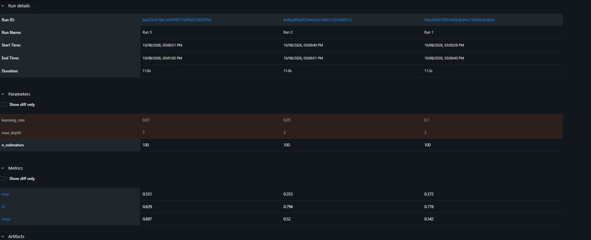
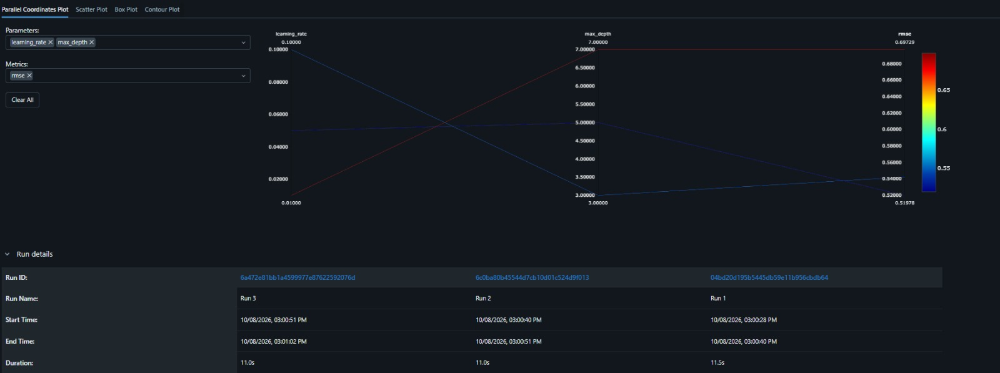

# ML Experiment Tracking with MLflow

## 1. Task Description

This project uses **MLflow** to track and compare machine learning experiments on a **House Price Prediction** problem (California Housing dataset).

The same model, `GradientBoostingRegressor`, is trained **three times** with different hyperparameters (`max_depth` and `learning_rate`). For every run, MLflow records the parameters, the validation metrics (RMSE, MAE, R²), and the trained model as an artifact. The best run is then selected using **RMSE** as the primary metric.

**Workflow:** Train → Track → Compare → Select

**Data split:** 80% training / 20% validation (`random_state=42` for reproducibility).

## 2. How to Run

```bash
# 1. Create and activate a virtual environment
python -m venv venv
venv\Scripts\activate         

# 2. Install dependencies
pip install -r requirements.txt

# 3. Run the experiments (creates mlflow.db and mlruns/)
python train.py

# 4. Open the MLflow UI
mlflow ui --backend-store-uri sqlite:///mlflow.db
```

Then open http://localhost:5000, select the experiment `California-House-Price-Prediction`, tick the three runs and click **Compare**.

> Note: `n_estimators=100` is fixed for all runs, so only `max_depth` and `learning_rate` change between them.

## 3. MLflow Experiment Results

The three runs were compared in the MLflow UI (**Compare** view). Note that MLflow lists the newest run first, so the columns appear in the order **Run 3, Run 2, Run 1**.



**Parallel coordinates plot (learning rate and max depth vs. RMSE):**



## 4. Comparison Table

| Run   | Max Depth | Learning Rate | RMSE   | MAE    | R²     |
|-------|-----------|---------------|--------|--------|--------|
| Run 1 | 3         | 0.1           | 0.5422 | 0.3716 | 0.7756 |
| Run 2 | 5         | 0.05          | **0.5198** | **0.3531** | **0.7938** |
| Run 3 | 7         | 0.01          | 0.6973 | 0.5311 | 0.6290 |

(Lower RMSE / MAE is better, higher R² is better. Target values are in units of $100,000.)

## 5. Selected Best Model

**Run 2** (`max_depth = 5`, `learning_rate = 0.05`) with **RMSE = 0.5198**.

## 6. Why This Model Was Selected

RMSE is the primary selection metric, and Run 2 has the lowest RMSE of the three runs. It also has the best MAE and R², so the choice is consistent across all metrics.

- **Run 1** (depth 3, lr 0.1) learns quickly but its shallow trees are less expressive, so it underfits slightly compared to Run 2.
- **Run 2** (depth 5, lr 0.05) gives the best balance: trees deep enough to capture feature interactions, with a moderate learning rate.
- **Run 3** (depth 7, lr 0.01) performs worst. With a very small learning rate and only 100 trees, the model does not have enough boosting steps to converge, so it underfits despite the deeper trees. It would likely need many more estimators to compete.

On average, Run 2's predictions are off by about $52,000 (RMSE), compared to about $54,000 for Run 1 and about $70,000 for Run 3.
